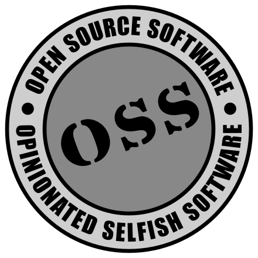

---
# https://vitepress.dev/reference/default-theme-home-page
layout: home

hero:
  name: "Badger Timestamp"
  tagline: Javascript Date and Time Utilities
  image:
    src: images/badger3.svg
    alt: Badger
  actions:
    - theme: brand
      text: Getting Started
      link: /getting-started
    - theme: alt
      text: Documentation
      link: /creating-timestamps
    - theme: alt
      text: Function Reference
      link: /reference
---
## Who Ordered This?

This module implements an object for parsing, representing, adjusting,
comparing and formatting ISO8601 timestamps.  It is designed with ease of
use in mind, making simple things simple and hard things possible.

## Example

```js
import { timestamp } from '@abw/badger-timestamp'

// create a Timestamp object from an ISO8601 timestamp
const ts = timestamp('2024-03-01T11:37:24')
// or the current date/time
//   const ts = timestamp()
// or in milliseconds since the Unix epoch (e.g. JS Date.getTime())
//   const ts = timestamp(1709293422471)
// or in seconds since the Unix epoch (e.g. file modification time)
//   const ts = timestamp({ unix: 123456789 })

// output the date, time, year, etc.
console.log(ts.date())                // 2024-03-01
console.log(ts.time())                // 11:37:24
console.log(ts.year())                // 2024
console.log(ts.monthName())           // March
console.log(ts.weekdayName())         // Friday

// adjust the timestamp
ts.adjust('3 days')
console.log(ts.date())                // 2024-03-04

// compare to another timestamp or date (time is optional)
console.log(ts.after('2024-02-28'))   // true
console.log(ts.before('2024-02-28'))  // false

```

## Opinionated and Selfish Software

::: warning WARNING - People Who Share Their Source Code Do Not Owe You Anything!
This is OSS: **Open Source Software** that you can freely download, use and adapt
if you want to. But here OSS also stands for **Opinionated and Selfish Software**.

It doesn't set out to please all the people, all the time. On the contrary,
it is designed to please one person (me) most of the time. I wrote it to help
me get my job done.  If it helps you get your job done then great.  But please
don't complain if it doesn't do what you want.  It's not my job to help you
do your job.

https://freeasinweekend.org/open-source-open-mind
:::

<center>

</center>


